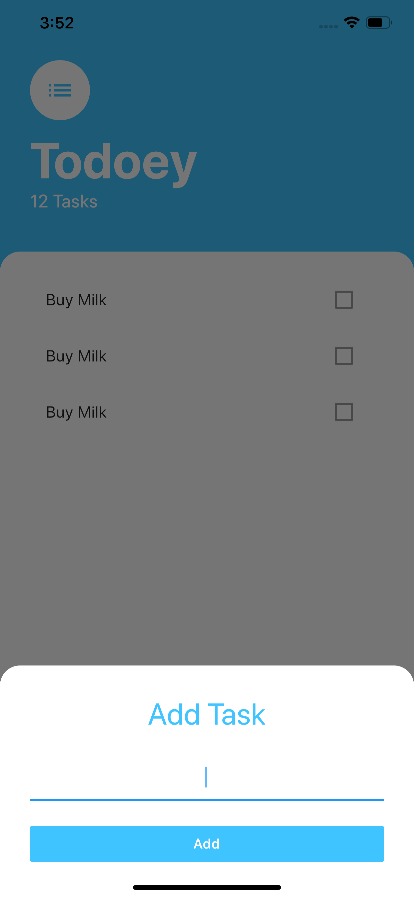

# The App Brewery - Flutter Bootcamp
The Complete Flutter Development Bootcamp Using Dart

[The App Brewery](https://www.appbrewery.co) by [Angela Yu](https://github.com/angelabauer)

This repo consolidates all the apps which you are going to build throughout the chapters of the course.

You can either clone the repo and run the apps on your local machine, but you need to make sure that you have [Flutter-SDK](https://flutter.dev/docs/get-started/install) installed:
```
git clone https://github.com/tea-mo903/flutter-bootcamp.git
cd flutter-bootcamp
# choose your chapter e.g. 12
cd chapter_12
fluttter run
```

Or you can download the `.apk` files from [github-actions](https://github.com/tea-mo903/flutter-bootcamp/actions).


## Chapter 1 - Simple Start


## Chapter 2 - Business Contact


## Chapter 3 - Rolling the Dice


## Chapter 4 - Oracle, Ask me Anything


## Chapter 5 - Xylophone (best ever made)


## Chapter 6 - True/False Knowsledge


## Chapter 7 - Destini Storygame


## Chapter 8 - BMI Calculator


## Chapter 9 - Weather


## Chapter 10 - Crypto Calculator


## Chapter 11 - Flash Chat


## Chapter 12 - Todoey



