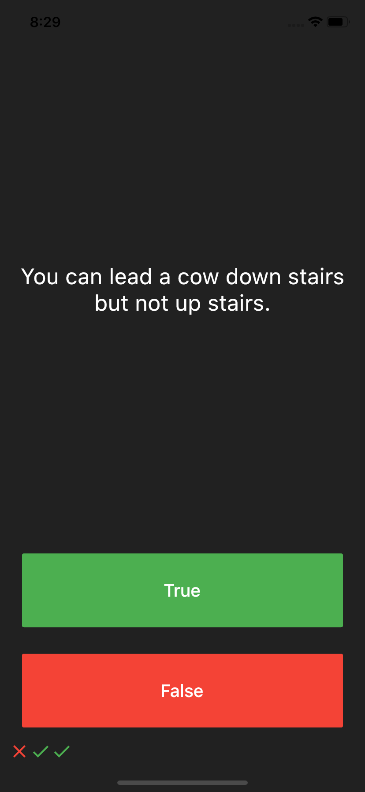
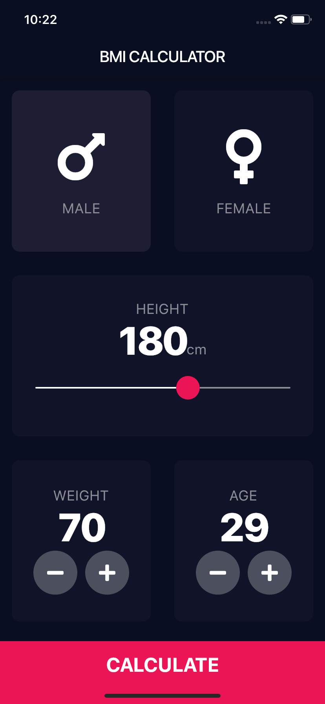
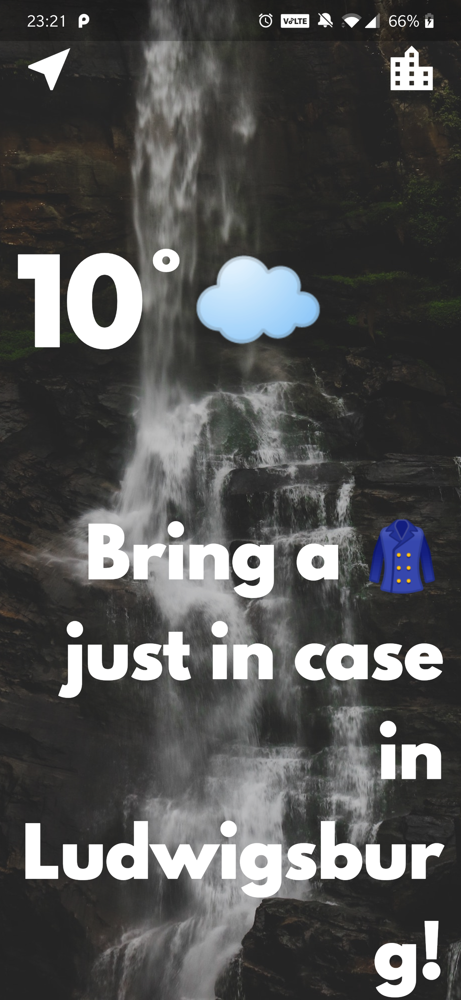
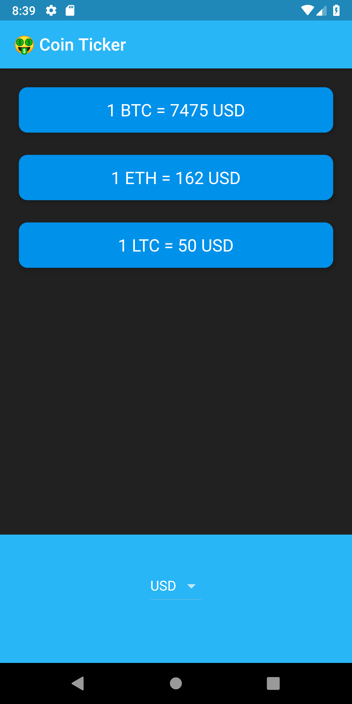
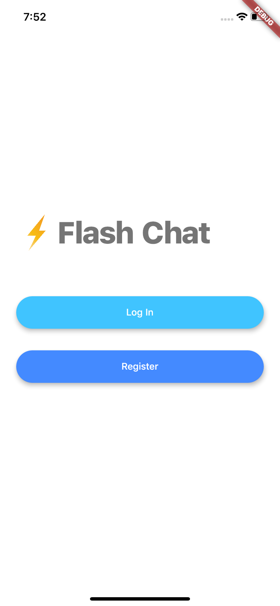

# The App Brewery - Flutter Bootcamp
The Complete Flutter Development Bootcamp Using Dart

[The App Brewery](https://www.appbrewery.co) by [Angela Yu](https://github.com/angelabauer)

This repo consolidates all the apps which you are going to build throughout the chapters of the course.

## Chapter 1

## Chapter 2

## Chapter 3

## Chapter 4

## Chapter 5

## Chapter 6

## Chapter 7

## Chapter 8

## Chapter 9

## Chapter 10

## Chapter 11

